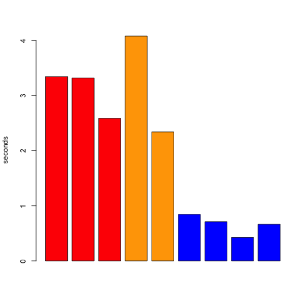

## Automatic checks

These are some scripts to check Oxford performance for Systematic Biology. Red=*Systematic Biology*, Orange=other Oxford journals, Blue=other publishers.

Advanced RSS feed valid:  **no**.

Current issue RSS feed valid: **no**.

## Other things to check manually:

https://academic.oup.com/sysbio/article/66/3/A3/3737781/Announcements: 2014 Publisher's award used to render as: `$\$$ 500 to each winner and a 2-year free subscription to Systematic Biology.` [note the dollar signs]. Does it still?

https://doi.org/10.1080/10635150701701083: Make sure single author in both paper and in downloads. (AE sometimes listed as coauthor).

## ToDo:

Add all past issues (OA, DOIs going to wrong journal, etc.)

